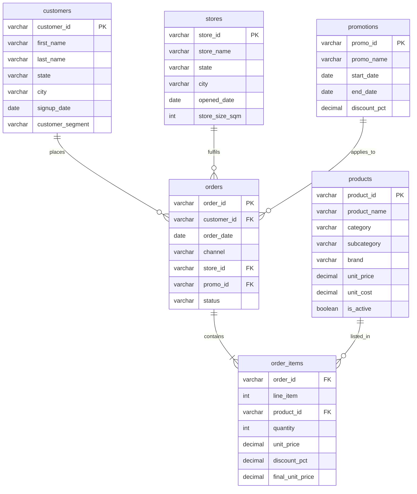

# FreshCart Australia: SQL Analytics for Grocery E-Commerce

## Overview

This project analyses 3 years of transactional data (2022-2024) from a fictional Australian online grocery retailer, **FreshCart**, to answer key commercial questions a category or commercial analyst would face in the FMCG space.

All analysis is done in **SQL (DuckDB)**, demonstrating proficiency with CTEs, window functions, cohort analysis, RFM segmentation, promotional ROI, market basket analysis, and more.

### Why DuckDB?

I find DuckDB a very interesting library. It is an in-process analytical database that runs entirely within Python with zero external dependencies, no server setup, and no configuration. With the recent release of [DuckDB 1.5.0 "Variegata"](https://duckdb.org/2026/03/09/announcing-duckdb-150) (March 2026), which introduced the VARIANT type, built-in GEOMETRY support, and significant performance improvements, I wanted to try it out in a Python environment and put it through its paces on a realistic analytical workload.

## Dataset

| Table | Rows | Description |
|-------|------|-------------|
| `customers` | 5,000 | Customer profiles with segment, location, signup date |
| `products` | 96 | Grocery SKUs across 7 FMCG categories with cost data |
| `stores` | 12 | Physical retail locations across Australia |
| `orders` | 24,074 | Transactions from Jan 2022 to Dec 2024 |
| `order_items` | 63,262 | Line-level detail with pricing and discounts |
| `promotions` | 7 | Promotional events (Black Friday, EOFY, etc.) |

**Schema (star schema pattern):**



## SQL Techniques Demonstrated

| Technique | Queries |
|-----------|---------|
| CTEs (Common Table Expressions) | 1, 2, 3, 4, 5, 6, 7, 8, 9, 12, 13, 15, 16 |
| Window functions (LAG, LEAD, RANK, ROW_NUMBER, NTILE) | 2, 4, 5, 6, 8, 10, 11, 13, 15, 16 |
| Rolling / moving averages | 11 |
| Cohort analysis | 3 |
| RFM segmentation | 4 |
| Self-joins (market basket) | 12 |
| CROSS JOIN for benchmarking | 10 |
| ROLLUP for subtotals | 7 |
| CASE-based bucketing | 4, 9, 13, 15 |
| Subqueries / derived tables | 6, 13 |

## Analysis Catalog

| # | Analysis | Business Question |
|---|----------|-------------------|
| 1 | Executive Summary | What are FreshCart's headline KPIs? |
| 2 | Monthly Revenue Trend (YoY) | How is revenue trending, and are we growing year over year? |
| 3 | Cohort Retention | How well do we retain customers from each acquisition cohort? |
| 4 | RFM Segmentation | Which customer segments drive the most value? |
| 5 | Category Performance | Which product categories contribute most to revenue and profit? |
| 6 | Top Products per Category | What are the best-selling SKUs within each category? |
| 7 | Promotional Effectiveness | Are our promotions lifting AOV and volume, or just eroding margin? |
| 8 | Channel Mix Trend | How is the Online vs In-Store vs Click-and-Collect split evolving? |
| 9 | Customer Lifetime Value | How does CLV differ across customer segments? |
| 10 | State Benchmarking | Which states over/under-perform vs the national average? |
| 11 | Rolling Revenue Trend | Where do we see revenue dipping below trend? |
| 12 | Market Basket Analysis | Which product categories are most commonly purchased together? |
| 13 | New vs Returning Revenue | How much revenue comes from first-time vs repeat buyers? |
| 14 | Store Scorecard | Which physical stores generate the best revenue per square metre? |
| 15 | Purchase Gap Analysis | How long do customers typically wait between orders? |
| 16 | Brand Share | Which brands dominate within each category? |

## Interactive Notebook

The file **`freshcart_sql_analysis.ipynb`** contains all 16 SQL queries with pre-populated outputs. This means you can review every query and its results directly on GitHub without needing to install DuckDB or run any code. Each query is accompanied by a markdown explanation covering the business question and the SQL techniques used.

If you want to run the queries yourself or modify them, you only need Python and the `duckdb` package (`pip install duckdb`).

## How to Run

### Quick Start (no installation needed)

Open **`freshcart_sql_analysis.ipynb`** on GitHub to view all 16 queries and their results immediately.

### Requirements (to run locally)
- Python 3.10+
- DuckDB (`pip install duckdb`)

### Run locally

```bash
# Load the database (already built)
python3 -c "
import duckdb
con = duckdb.connect('grocery_analytics.duckdb')
print(con.execute('SELECT * FROM orders LIMIT 5').fetchdf())
"
```

### Run a specific query
Copy any query from `analysis.sql` and execute it against the DuckDB database.

### Rebuild from CSVs

The database is built using `schema.sql`, which defines all tables with explicit primary keys, foreign keys, and constraints. To rebuild from scratch:

```bash
python3 setup_database.py
```

Or manually:
```python
import duckdb
con = duckdb.connect('grocery_analytics.duckdb')

# Create tables with schema
with open('schema.sql') as f:
    for stmt in f.read().split(';'):
        stmt = stmt.strip()
        if stmt and not stmt.startswith('--'):
            con.execute(stmt)

# Load data in dependency order
for table in ['customers', 'products', 'stores', 'promotions', 'orders', 'order_items']:
    con.execute(f"INSERT INTO {table} SELECT * FROM read_csv_auto('data/{table}.csv')")
```

## Key Findings (summary)

- **$1.67M total revenue** over 3 years, with 28.9% gross margin
- **Champions segment** (14% of customers) drives 23.8% of revenue
- **Coffee** is the highest-revenue category ($377K), but **Breakfast** leads in order penetration
- **EOFY promotions** offer the deepest discounts (20%) but need margin analysis to assess true ROI
- **Online channel** share has been growing steadily quarter over quarter
- Most customers repurchase within **31 to 60 days**, suggesting a monthly shopping cycle

## Project Structure

```
freshcart-sql-project/
├── freshcart_sql_analysis.ipynb    # All 16 queries with outputs (view on GitHub)
├── analysis.sql                    # Full SQL source with detailed comments
├── schema.sql                      # Table definitions with PKs, FKs, constraints
├── grocery_analytics.duckdb        # Pre-built DuckDB database
├── setup_database.py               # Rebuild database from schema + CSVs
├── data/
│   ├── customers.csv               # 5,000 customer profiles
│   ├── products.csv                # 96 grocery SKUs
│   ├── stores.csv                  # 12 retail locations
│   ├── orders.csv                  # 24,074 transactions
│   ├── order_items.csv             # 63,262 line items
│   └── promotions.csv              # 7 promotional events
└── README.md
```

## Tools

- **SQL Engine:** DuckDB 1.5.0
- **Data Generation:** Synthetic dataset
- **Analysis Notebook:** Jupyter Notebook with pre-executed outputs
- **Visualisation:** (to be added separately)

## Author

**Ryan Do**
Data Analyst | UTS Data Science Tutor
[Portfolio](https://ryando.au)
